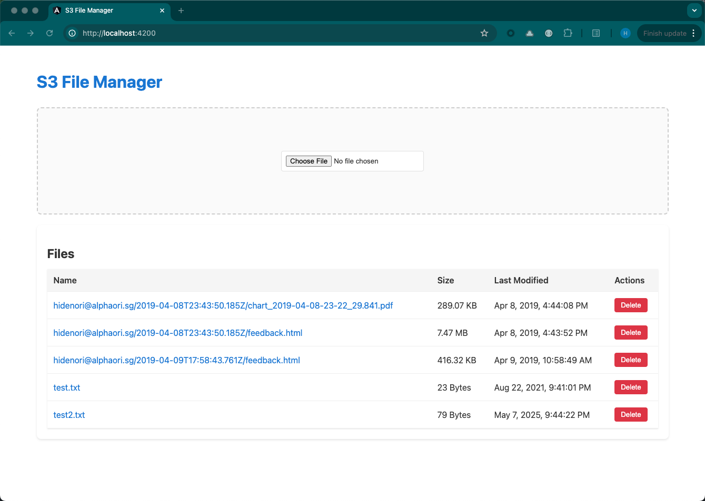

# S3 File Manager

A modern web application built with Angular 16 for managing files in Amazon S3 buckets. This application provides a user-friendly interface for uploading, downloading, and managing files in your S3 storage.

## Features

- **File Management**
  - Upload single or multiple files to S3 buckets
  - Download files from S3 buckets
  - Delete files and folders
  - Create new folders
  - Rename files and folders
  - Move files between folders

- **User Interface**
  - Modern and responsive design
  - Drag and drop file upload
  - File preview capabilities
  - Progress indicators for uploads/downloads
  - Breadcrumb navigation
  - Search and filter functionality

- **Security**
  - Secure file operations using AWS SDK
  - Role-based access control
  - Secure credential management
  - File encryption support

## Prerequisites

- Node.js (v14 or higher)
- Angular CLI (v16.2.16)
- AWS account with S3 access
- AWS credentials configured
- Git

## Installation and Setup

1. Clone the repository:
```bash
git clone [your-repository-url]
cd s3-file-manager
```

2. Install dependencies:
```bash
npm install
```

3. Configure AWS credentials:
   - Create a `.env` file in the root directory
   - Add your AWS credentials:
     ```
     AWS_ACCESS_KEY_ID=your_access_key
     AWS_SECRET_ACCESS_KEY=your_secret_key
     AWS_REGION=your_region
     S3_BUCKET_NAME=your_bucket_name
     ```

4. Start the backend server:
```bash
# Start the Node.js backend server
node server.js
# or
npm run server
```

The backend server will run on port 3000 by default.

5. Start the frontend development server (in a new terminal):
```bash
# Start the Angular development server
npm start
# or
ng serve
```

The frontend application will be available at `http://localhost:4200/`

## Server Requirements

### Backend Server (Node.js)
- Node.js server running on port 3000
- Express.js for API endpoints
- AWS SDK for S3 operations
- Minimum 1GB RAM recommended
- 500MB free disk space

### Frontend Server (Angular)
- Angular development server on port 4200
- Minimum 1GB RAM recommended
- 500MB free disk space

### Production Environment
- Node.js server with PM2 or similar process manager
- Minimum 4GB RAM recommended
- 2GB free disk space
- SSL certificate for HTTPS
- Domain name (optional)

### Server Setup for Production

1. Install PM2 globally:
```bash
npm install -g pm2
```

2. Build the frontend application:
```bash
npm run build --prod
```

3. Start the backend server using PM2:
```bash
pm2 start server.js --name "s3-file-manager-backend"
```

4. Configure PM2 to start on system boot:
```bash
pm2 startup
pm2 save
```

## Project Structure

```
s3-file-manager/
├── src/
│   ├── app/
│   │   ├── components/     # UI components
│   │   ├── services/       # AWS and other services
│   │   ├── models/         # TypeScript interfaces
│   │   └── utils/          # Utility functions
│   ├── assets/            # Static assets
│   └── environments/      # Environment configurations
├── server.js             # Backend server file
├── routes/              # API routes
├── controllers/         # Route controllers
├── middleware/          # Custom middleware
├── tests/              # Test files
└── dist/              # Build output
```

## Development

### Backend Development Server

The backend server runs on port 3000 and provides the following features:
- RESTful API endpoints for S3 operations
- File upload/download handling
- Authentication middleware
- Error handling
- CORS configuration

To start the backend server:
```bash
node server.js
```

### Frontend Development Server

The frontend development server runs on port 4200 and provides:
- Hot Module Replacement (HMR)
- Live reload on file changes
- Source maps for debugging
- Error overlay for runtime errors

To start the frontend server:
```bash
npm start
```

### Build

Run `npm run build` or `ng build` to build the project. The build artifacts will be stored in the `dist/` directory.

### Running unit tests

Run `npm test` or `ng test` to execute the unit tests via [Karma](https://karma-runner.github.io).

### Running end-to-end tests

Run `npm run e2e` or `ng e2e` to execute the end-to-end tests via [Protractor](http://www.protractortest.org/).

## Deployment

1. Build the frontend application:
```bash
npm run build --prod
```

2. Deploy to your preferred hosting service (AWS S3, Netlify, Vercel, etc.)

3. Configure environment variables on your hosting platform

4. Set up a production server:
   - Install Node.js on your server
   - Install PM2: `npm install -g pm2`
   - Copy the built files to your server
   - Start the backend server using PM2
   - Configure your web server (Nginx/Apache) as a reverse proxy

Example Nginx configuration:
```nginx
server {
    listen 80;
    server_name your-domain.com;

    # Frontend
    location / {
        proxy_pass http://localhost:4200;
        proxy_http_version 1.1;
        proxy_set_header Upgrade $http_upgrade;
        proxy_set_header Connection 'upgrade';
        proxy_set_header Host $host;
        proxy_cache_bypass $http_upgrade;
    }

    # Backend API
    location /api {
        proxy_pass http://localhost:3000;
        proxy_http_version 1.1;
        proxy_set_header Upgrade $http_upgrade;
        proxy_set_header Connection 'upgrade';
        proxy_set_header Host $host;
        proxy_cache_bypass $http_upgrade;
    }
}
```

## Technologies Used

- Angular 16
- AWS SDK for JavaScript v3
- RxJS
- TypeScript
- Angular Material
- SCSS
- Jest for testing

## Contributing

1. Fork the repository
2. Create your feature branch (`git checkout -b feature/amazing-feature`)
3. Commit your changes (`git commit -m 'Add some amazing feature'`)
4. Push to the branch (`git push origin feature/amazing-feature`)
5. Open a Pull Request

Please read [CONTRIBUTING.md](CONTRIBUTING.md) for details on our code of conduct and the process for submitting pull requests.

## License

This project is licensed under the MIT License - see the [LICENSE](LICENSE) file for details.

## Support

For support, please [create an issue](your-repository-url/issues) in the repository.

## Acknowledgments

- AWS SDK team for their excellent documentation
- Angular team for the amazing framework
- All contributors who have helped shape this project

## Screenshots

[](./documents/2025-05-07_21-54-00.png)
