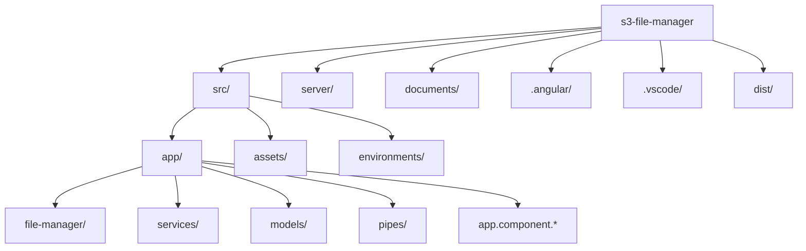
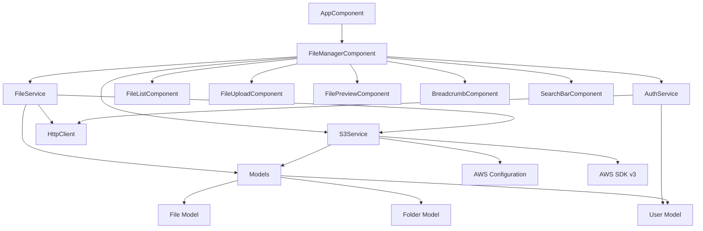

# S3 File Manager

A modern web application built with Angular 16 for managing files in Amazon S3 buckets. This application provides a user-friendly interface for uploading, downloading, and managing files in your S3 storage.

## Features

- **File Management**
  - Upload single or multiple files to S3 buckets
  - Download files from S3 buckets
  - Delete files and folders
  - Create new folders
  - Rename files and folders
  - Move files between folders
  - File preview for common formats (images, PDFs, text)

- **User Interface**
  - Modern and responsive design using Angular Material
  - Drag and drop file upload with progress tracking
  - File preview capabilities
  - Progress indicators for uploads/downloads
  - Breadcrumb navigation
  - Search and filter functionality
  - Dark/Light theme support

- **Security**
  - Secure file operations using AWS SDK v3
  - Role-based access control
  - Secure credential management
  - File encryption support
  - CORS configuration
  - Rate limiting

## Prerequisites

- Node.js (v16 or higher)
- Angular CLI (v16.2.16)
- AWS account with S3 access
- AWS credentials configured
- Git

## Quick Start

1. Clone the repository:
```bash
git clone [your-repository-url]
cd s3-file-manager
```

2. Install dependencies:
```bash
npm install
```

3. Configure AWS credentials:
   - Create a `.env` file in the root directory
   - Add your AWS credentials:
     ```
     # AWS Credentials
     AWS_ACCESS_KEY_ID=your_access_key_id
     AWS_SECRET_ACCESS_KEY=your_secret_access_key
     AWS_REGION=your_region
     AWS_BUCKET_NAME=your_bucket_name
     AWS_ENDPOINT=your_endpoint
     ```
   - Make sure to add `.env` to your `.gitignore` file to prevent committing sensitive information
   - Never commit actual AWS credentials to version control

4. Start the development servers:
```bash
# Terminal 1 - Start the backend server
npm run server

# Terminal 2 - Start the frontend server
npm start
```

The application will be available at:
- Frontend: `http://localhost:4200`
- Backend API: `http://localhost:3000`

## System Requirements

### Development Environment
- Node.js v16+
- 2GB RAM minimum
- 1GB free disk space
- Modern web browser

### Production Environment
- Node.js v16+
- 4GB RAM minimum
- 2GB free disk space
- SSL certificate for HTTPS
- Domain name (optional)

## Project Structure

```
s3-file-manager/
├── src/
│   ├── app/
│   │   ├── file-manager/    # File manager component
│   │   ├── services/        # AWS and other services
│   │   ├── models/          # TypeScript interfaces
│   │   ├── pipes/           # Custom pipes
│   │   └── app.component.*  # Main application component
│   ├── assets/             # Static assets
│   └── environments/       # Environment configurations
├── server/
│   └── server.js          # Backend server file
├── documents/            # Documentation and screenshots
├── .angular/            # Angular build files
├── .vscode/            # VS Code configuration
└── dist/               # Build output
```

### Project Structure Diagram



### Class Relationships and Dependencies



The diagrams above show:

1. **Project Structure**
   - Directory layout of the application
   - Main folders and their relationships
   - Angular application structure

2. **Class Relationships and Dependencies**
   - Component hierarchy and relationships
   - Service dependencies and interactions
   - Model relationships
   - External dependencies (AWS SDK, HttpClient)

## Development

### Available Scripts

```bash
# Start frontend development server
npm start

# Start backend development server
npm run server

# Build the application
npm run build

# Run unit tests
npm test

# Run e2e tests
npm run e2e

# Lint the code
npm run lint
```

### Backend Development

The backend server provides:
- RESTful API endpoints for S3 operations
- File upload/download handling
- Authentication middleware
- Error handling
- CORS configuration
- Rate limiting
- Request logging

### Frontend Development

The frontend application features:
- Hot Module Replacement (HMR)
- Live reload on file changes
- Source maps for debugging
- Error overlay for runtime errors
- Angular Material components
- Responsive design

## Deployment

### Production Build

1. Build the frontend application:
```bash
npm run build --prod
```

2. Deploy to your preferred hosting service:
   - AWS S3 + CloudFront
   - Netlify
   - Vercel
   - Heroku

### Server Setup

1. Install PM2 globally:
```bash
npm install -g pm2
```

2. Start the backend server:
```bash
pm2 start server.js --name "s3-file-manager-backend"
```

3. Configure PM2 to start on system boot:
```bash
pm2 startup
pm2 save
```

### Nginx Configuration Example

```nginx
server {
    listen 80;
    server_name your-domain.com;

    # Frontend
    location / {
        root /path/to/your/dist;
        try_files $uri $uri/ /index.html;
    }

    # Backend API
    location /api {
        proxy_pass http://localhost:3000;
        proxy_http_version 1.1;
        proxy_set_header Upgrade $http_upgrade;
        proxy_set_header Connection 'upgrade';
        proxy_set_header Host $host;
        proxy_cache_bypass $http_upgrade;
    }
}
```

## Technologies

- **Frontend**
  - Angular 16
  - Angular Material
  - RxJS
  - TypeScript
  - SCSS

- **Backend**
  - Node.js
  - Express.js
  - AWS SDK v3
  - Jest

## Contributing

1. Fork the repository
2. Create your feature branch (`git checkout -b feature/amazing-feature`)
3. Commit your changes (`git commit -m 'Add some amazing feature'`)
4. Push to the branch (`git push origin feature/amazing-feature`)
5. Open a Pull Request

Please read [CONTRIBUTING.md](CONTRIBUTING.md) for details on our code of conduct and the process for submitting pull requests.

## License

This project is licensed under the MIT License - see the [LICENSE](LICENSE) file for details.

## Support

For support:
- [Create an issue](your-repository-url/issues)
- Check the [documentation](./docs)
- Join our [Discord community](your-discord-url)

## Screenshots

[](./documents/2025-05-07_21-54-00.png)
